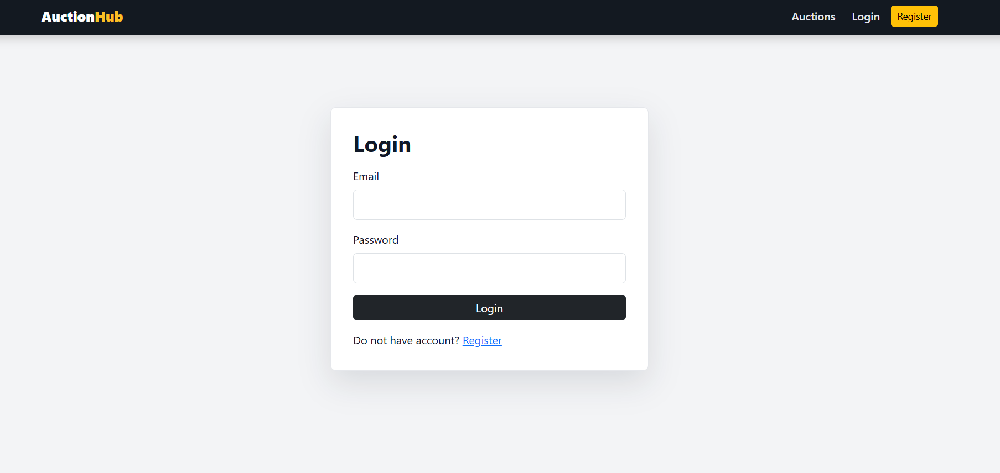
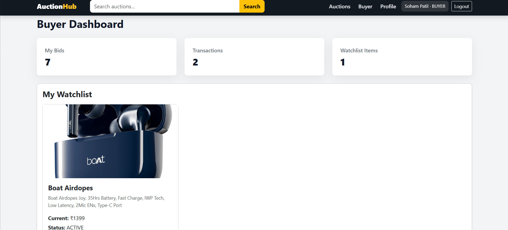
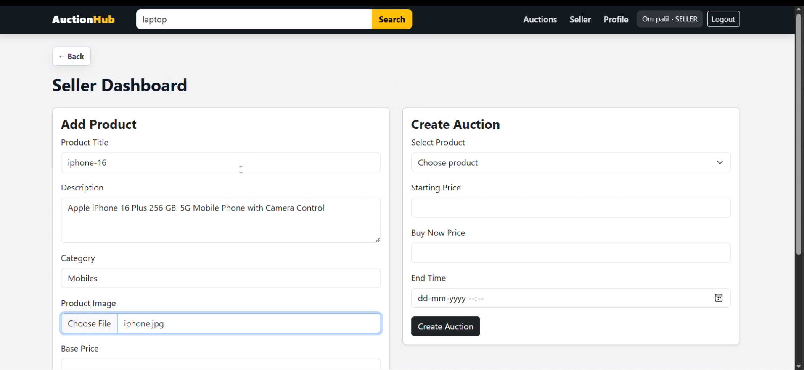
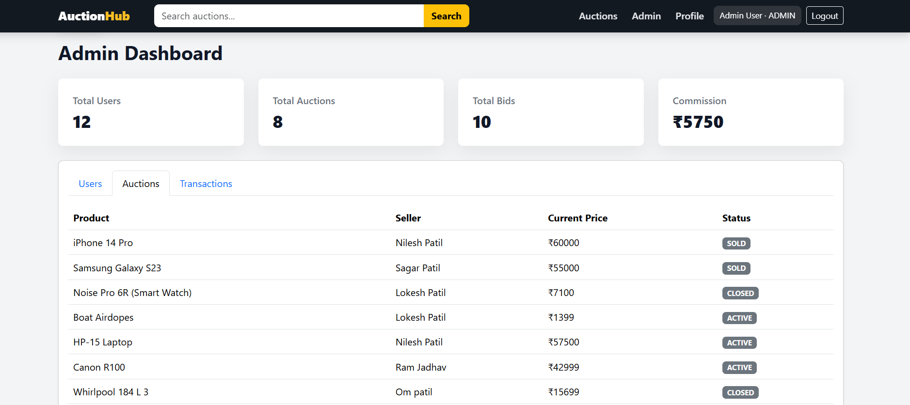
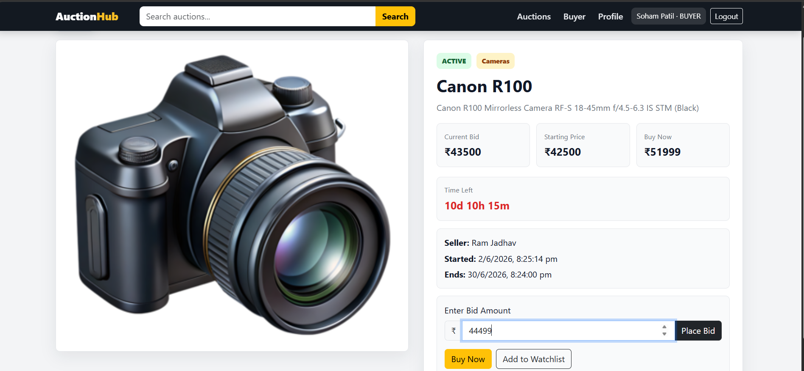

# Online Auction Platform

A full-stack Online Auction Platform built using Java Spring Boot, React.js, MySQL, JWT, and WebSocket/STOMP. The platform enables sellers to create auctions, buyers to place real-time bids, and admins to monitor overall platform activity.

---

## Project Overview

The Online Auction Platform digitizes the traditional auction process by providing a secure and interactive platform for buyers and sellers.

The system supports three user roles:

* **Buyer**
* **Seller**
* **Admin**

### Buyer

* Browse active auctions
* Place real-time bids
* Add products to watchlist
* Use Buy Now option
* View transaction history

### Seller

* Upload and manage products
* Create auctions
* Track auction status
* Monitor bidding activity

### Admin

* Manage users
* Block/unblock accounts
* Monitor auctions
* View transactions
* Track commission data

---

## Tech Stack

### Backend

* Java
* Spring Boot
* Spring Security
* JWT Authentication
* Spring Data JPA
* MySQL
* WebSocket/STOMP
* Maven

### Frontend

* React.js
* Bootstrap
* Axios
* CSS
* Vite

---

## Key Features

### Authentication & Authorization

* User registration and login
* JWT-based authentication
* Role-based access control
* Secure API access

### Real-Time Bidding

* Live bid updates using WebSocket/STOMP
* Instant price updates
* Backend bid validation
* Real-time auction monitoring

### Auction Management

* Create auctions
* Track active auctions
* Automatic auction closing
* Winner selection

### Dashboard Management

* Buyer dashboard
* Seller dashboard
* Admin dashboard

---

## Project Architecture

Frontend (React.js)
↓
REST APIs / WebSocket
↓
Backend (Spring Boot)
↓
Service Layer
↓
Repository Layer
↓
MySQL Database

---

## Project Structure

```bash
online-auction-platform
|
├── online-auction-backend
│   ├── src/main/java/com/auction
│   │   ├── controller
│   │   ├── service
│   │   ├── repository
│   │   ├── entity
│   │   ├── dto
│   │   ├── config
│   │   ├── security
│   │   └── exception
│   │
│   └── src/main/resources
│       └── application.properties
│
└── online-auction-frontend
    ├── src
    │   ├── components
    │   ├── pages
    │   ├── services
    │   ├── assets
    │   ├── App.jsx
    │   ├── main.jsx
    │   └── style.css
    │
    └── package.json
```

---

## Database Design

Main tables:

* Users
* Products
* Auctions
* Bids
* Transactions
* Watchlist

Relationships:

* One User → Many Products
* One Product → One Auction
* One Auction → Many Bids
* One Buyer → Many Transactions

---

## Installation & Setup

### Backend Setup

```bash
git clone <repository-url>
cd online-auction-backend
```

Configure database in `application.properties`

```properties
spring.datasource.url=jdbc:mysql://localhost:3306/auction_db
spring.datasource.username=root
spring.datasource.password=your_password
```

Run backend:

```bash
mvn spring-boot:run
```

---

### Frontend Setup
```bash
cd online-auction-frontend
npm install
npm run dev


```bash
## Screenshots

### Home Page


### Login Page


### Buyer Dashboard


### Seller Dashboard


### Admin Dashboard


### Auction Details

```

---

## Future Enhancements

* Payment Gateway Integration
* AI-based Product Recommendations
* Notification System
* Email Alerts
* Cloud Deployment

---

## Learning Outcomes

This project helped in gaining practical experience in:

* Full Stack Development
* REST API Development
* Authentication & Authorization
* Database Design
* Real-Time Communication using WebSocket
* Role-Based Access Control

---

## Author

**Gaurav Mandage**
Aspiring Java Full Stack Developer
